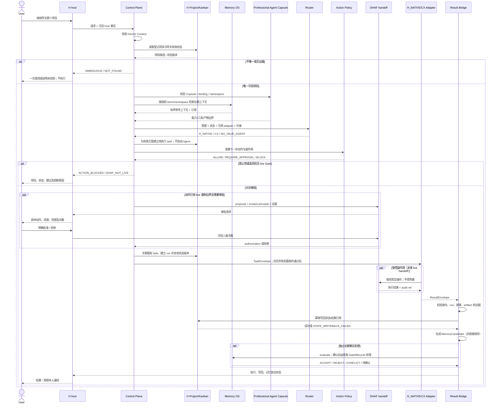

# Personal Agent Control Plane V0.1 — 最小集成契约

冻结日期：2026-10-05（Asia/Shanghai）。状态：DESIGN_FROZEN，IMPLEMENTATION_NOT_STARTED，LIVE_NOT_VALIDATED。

本文冻结责任、字段、决策和未来验收，不实现接口，不授予运行权限。冻结通过不等于功能可用、安全验收通过或 DHAF LIVE_READY。变更须显式更新契约和对应验收，禁止实现方静默降低约束。

## 1. Scope / Non-goals

唯一产品主链：用户在当前 Win10 的 H 中说“继续昨天那个项目”，系统可靠识别项目、机器、最后有效状态、下一步、H_NATIVE/CX 候选、审批要求、结果位置和长期记忆候选。

H 是用户主入口及 host；Control Plane 是薄聚合、路由、策略与桥接层。首批仅 H_NATIVE/CX；当前机器执行，单个任务串行调度，一个可信写入者负责 DHAF 与 Memory OS 各自存储。

不新增项目数据库、Kanban/队列、cron/scheduler、Memory lifecycle、Capsule、Artifact Workspace、TrustKernel、审批/审计引擎或 Agent runtime。不引入重型框架、向量库、全量聊天保存、无限自主 Agent。WB/AC/豆包工作、跨机器执行和对外发送均不在执行范围。

## 2. Existing Component Ownership

| 组件 | 唯一职责/主要来源 | 现有证据及边界 |
| --- | --- | --- |
| H projects | 项目 ID、名称、登记 workspace | H `hermes_cli/projects_db.py`、`tools/project_tools.py`；目录绑定不等于 OS 文件沙箱 |
| H Kanban | 实时任务、状态、结果引用、执行记录和事件 | `hermes_cli/kanban_db.py`、`kanban_db_dispatch.py`、`gateway/kanban_watchers.py`；默认 worker 是 H，不是 CX |
| H host | tools registry、CLI/MCP/API、hooks、cron/notifier | 源码能力不证明本机入口已启用或常驻 |
| Memory OS | 选定长期事实、retrieve/relevance/minimal injection、conflict/supersede/retire | `core/engine.py`、`smart/layer.py`；不能充当执行状态库；单用户串行写入 |
| h-professional-agent | Capsule、project binding、skill/tool 选择、namespace、产物边界 | `hpa/core.py`、`hermes_entry.py`、`tests/test_scopes.py`；现有真实 H CLI 验收仅 synthetic A/B，非 Desktop 全局集成 |
| DHAF | TrustKernel、授权绑定、Evidence Gate、ToolGateway、audit/replay、registry | `core/trust-kernel/trust_kernel.py`、`core/tool-gateway/tool_gateway.py`；强制执行只覆盖自己拥有的 file.write/shell.exec；Decision Gate 为 shadow |

审计版本基线：H ea81748579e / 0.21.5+6750.gea81748；Memory OS e53d430 / 0.9.0rc2；本仓库 8801dec / 0.1.0；DHAF d86ea17 / 0.1.0-dev。真实数据接入、CX adapter、当前常驻和逐动作 live enforcement 均未验收。

证据来源：本仓库 `VALIDATION.md` 及本机 synthetic artifacts；Memory OS `docs/hermes-v02-regression.md`；DHAF `docs/v0.1-contract-freeze.md` 与 Gateway README/测试。它们是历史或源码证据，不宣称本轮运行测试。DHAF 旧 H hook 审计中的 silent nonzero fail-open 已被当前 H 源码及测试修正，但不据此提升 DHAF readiness。DHAF 组合效果和跨步骤权限缺口仍保留。

## 3. Control Plane Responsibilities

只新增 Continue Resolver、可信 Device Context 聚合、Agent 路由扩展、H_NATIVE/CX adapter 映射、Action Policy 分类、Project State/Result Bridge、Memory Candidate Bridge 和本人通知映射。复用已有 registry 的声明部分，不复制 DHAF 运行逻辑。

Memory ≠ Project State；Router ≠ Executor；Policy ≠ Enforcement；Registry ≠ Router；Codex 模型 provider ≠ CX Agent；存在 DHAF ≠ 动作已受到强制保护。

## 4. Core Contracts

所有契约具有 `contract_version=personal-control-plane.v0.1`。时间使用带时区 ISO-8601；内部比较用 UTC，“昨天”按可信 host 的 Asia/Shanghai 日历日期，不按模型猜时间。confidence 为 0..1，不能覆盖身份、权限或新鲜度失败。缺失事实为 null/UNKNOWN，禁止生成伪默认值。

**身份与引用：** `project_id` 采用 H 登记 ID，贯穿 Capsule、CP、Task 和 Result。既有 Capsule ID 不同须经用户确认建立非秘密映射，未映射阻断，禁止按目录名合并。`memory_namespace` 沿用 Capsule，保留该 ID 到 namespace 的显式关联，不迁移记忆。`task_id` 在 H Kanban 创建，贯穿 dispatch/execution/result/audit；CP 不另建队列。外部 session/run ID 只能附属关联，不能替代 task_id。DHAF 不适合直接记录业务 ID 时，由 H 任务引用关联 opaque audit task ref；不在 DHAF 日志记录路径、内容或凭据。

`source_refs` / context / audit / artifact refs 均为可信 host 可验证的引用：包含所属项目/任务、版本或时间与摘要。模型给出的引用必须校验，不能直接作为权威。聊天只能提供名称线索，不能设定设备、workspace、approval 或 capability。

### ContinueResolver

输入：用户表达、DeviceContext、H 已登记项目、可访问 Kanban 状态/事件及明确会话 project binding。可用 Memory 提供名称/长期背景线索，但不能覆盖 H 状态。

输出字段：`project_id, project_name, confidence, device_id, workspace, last_valid_state, next_candidate_action, ambiguity`；补充 `resolution_status, source_refs, candidate_project_ids`。resolution_status 为 RESOLVED/AMBIGUOUS/NOT_FOUND；ambiguity 为歧义原因和候选列表，已唯一解析时为空。未解析不得输出执行 workspace 或提交任务。

唯一匹配规则：明确名称/登记别名或有效显式绑定可确定唯一项目；“昨天”只从该用户可访问项目的昨天有效任务/结果事件筛选。高置信继续须同时满足唯一证据候选、ID/路径映射有效、confidence >= 0.90。该阈值是决策规则，不声称模型分数已校准。多个匹配必须 AMBIGUOUS，只问一次“你指哪个项目”；没有匹配为 NOT_FOUND。最近活动不能擅自消除多项目歧义；Memory 命中或 CWD 不能单独确定项目。“昨天 CX 做到哪了”是状态查询，不自动授权重启 CX。

### DeviceContext

字段：`device_id, hostname, os, user, trusted_workspace_roots, available_adapters, last_seen, source, confidence`；补充 `trust_status, observed_at, expires_at`。

device_id 来自可信登记与 H 安装身份关联，不能从聊天、模型或复制来的 install_id 直接认定物理机器。hostname/os/user 来自本机事实；roots 来自用户授权登记并按 Windows 规范路径解析，检查 junction/symlink 后的边界。hostname 不是认证凭据。当前只允许登记的 Win10；未来 OS 字段可容纳 Win11/Mac-Win10，异机请求仍 BLOCK。

source 记录登记及本机观测依据。available_adapters 是实时可信探测结果，不是配置名单；观测超过 60 秒、身份矛盾或探测失败即 UNKNOWN，执行前再核准。探测不得发模型任务、读取 secret 或安装软件。动态不可用不撤销静态登记，但不得执行。

## 5. State Model

NormalizedProjectState 是派生读视图，不是第二套持久项目库。字段：`project_id, project_name, workspace, device_id, status, last_task, last_result, last_valid_state, next_action, updated_at, source_refs`。last_task/result 为带身份及验证状态的引用；next_action 是候选，绝不是授权。

H Project/Kanban 是实时唯一主要来源；Memory 是长期背景；Capsule 是项目能力与边界。status 映射为 IDLE/READY/RUNNING/WAITING_APPROVAL/BLOCKED/COMPLETED/FAILED/UNKNOWN；对应 H 原生状态的映射必须有证据，不强行改写 H 枚举。last_valid_state 只来自已校验结果、可信 host 事件或用户确认；“最新”不自动等于“有效”。

H 任务描述/已有 metadata、result、comments、events 承载必要关联与摘要；不新建表。接入方若无法通过 H 支持接口表达必要字段，报告 STATE_WRITEBACK_FAILED/接口缺口，禁止直写 DB 或偷偷增加存储。

项目读取后、invoke 前、结果回写前均校验 H 状态版本/事件游标及 Capsule digest。状态变化使方案失效时暂停重解析，不执行旧计划。状态写回通过可信 bridge 调用 H 支持接口，属于限定状态更新能力；必须重新校验项目、任务、run 及版本，不借此获得任意文件写权限。

## 6. Adapter Contract

最小接口：`adapter_id, capabilities, availability, invoke(task_envelope), status(task_id), cancel(task_id), result(task_id)`。这里只定义行为，未提供实现。registry 复用 DHAF 的 id/version/capabilities/evidence/status/enabled 声明，增加 interface、health、observed_at/expires_at、read_only_enforced、enforcement_evidence_refs；不得冒称 DHAF 已支持自动发现。

availability 为 AVAILABLE/UNAVAILABLE/UNKNOWN；health 为 HEALTHY/DEGRADED/UNKNOWN。只有 enabled、证据有效、AVAILABLE/HEALTHY 且观测未过期才能被路由。安装/注册不授予调用权限。

TaskEnvelope 必需字段：`task_id, project_id, device_id, intent, instructions, workspace, allowed_tools, risk_class, approval_state, memory_context_ref, artifact_target`。补充 `run_id, capsule_digest, state_version, policy_version, enforcement_ref, authorization_ref, deadline, source_refs`；run_id 由 H 执行记录关联。

approval_state 为 NOT_REQUIRED/PENDING/APPROVED/DENIED/EXPIRED/UNKNOWN，由可信 host/DHAF提供；模型输入 APPROVED 无效。allowed_tools 取 Capsule、adapter 能力、host 约束及 Gate 授权的交集，instructions 不能扩权。artifact_target 沿用 Capsule Artifact Workspace，由已有可信产物写入者处理；只读 Agent 本身不因需要产物而获得文件写权限。

ResultEnvelope：`task_id, adapter_id, status, summary, artifacts, state_changes, errors, audit_refs, memory_candidates`；补充 `project_id, device_id, run_id, execution_state, writeback_state, verification_refs`。state_changes 是声明，必须核验后才写回；artifacts 不得越界或冒充已生成文件。

执行状态：ACCEPTED/RUNNING/WAITING_APPROVAL/SUCCEEDED/FAILED/CANCEL_REQUESTED/CANCELLED/UNKNOWN。超时、失联、进程退出不能单独证明动作未发生。cancel 是停止请求，只有 host 证明停止才 CANCELLED；不得宣称已回滚。result/status 查询必须幂等。同一 task/run 重复 invoke 返回已有记录，不启动第二次执行；不确定运行禁止自动重试。

**H_NATIVE：** 使用 H 支持入口及 tools registry，延用 project binding。低风险读取只有在实际工具/路径权限可验证且无副作用时可执行；提示词及当前 hpa-selected 集合不构成沙箱。动态工具要求若无法验证只读和边界，则不可用。修改必须由 DHAF-owned 路径承担，原生写工具不能旁路。现有 synthetic store-only 限制不因本文自动解除。

**CX：** 通过真实 Codex Agent CLI（候选为 codex exec），不是 Codex 模型 provider。显式 workspace、task/run 关联、限时、结构化结果及审批/Gate引用；确切 CLI 参数须在后续适配阶段核准。只读执行须有实际 sandbox/工具权限证据；受控写执行须证明每个副作用经过 Gate，不能用 codex exec 外层一次审批包住无限内部动作。没有逐动作控制证据就 BLOCK 写任务，不能用 skill/prompt 代替。

## 7. Router Contract

输入：`task_intent, project_capsule, device_context, available_adapters, required_tools, risk_class`，以及当前状态引用/策略版本。输出的 agent_choice 只能是 H_NATIVE/CX/NO_VALID_AGENT；附 selection_reason、matched_capabilities、constraint_checks、source_refs、expires_at。

复用现有 Capsule capability selection 和 skill/tool requirements；新增的是 adapter 约束映射。先过滤项目、机器、工具、健康及可强制执行边界，再选择：状态查询/提醒/计划优先 H_NATIVE；满足约束的代码工作优先 CX。两者均不合格则 NO_VALID_AGENT；未明确任务或 Capsule 路由低置信时要求澄清，禁止仅凭一句 prompt 猜 Agent。现有 Router 的英文触发限制须保留，中文未命中不能假装匹配。

Router 只推荐，最终 Action Policy 与 DHAF 再校验；路由到 CX 不授权执行。禁止失败后静默换 Agent，任何候选变更都重做边界/政策核准。

## 8. Action Policy

输出：`decision=ALLOW/REQUIRE_APPROVAL/BLOCK, risk_class, reasons, required_enforcement, source_refs, policy_version`。risk_class 为 LOW_READ/CONTROLLED_MUTATION/HIGH_RISK/PROHIBITED/UNKNOWN；未知默认 BLOCK。Control Plane 只分类与传递，不能自行生成 approval/authorization。

| 动作 | 决策 | 条件 |
| --- | --- | --- |
| 查询 H 状态、按项目查 Memory、生成计划/消息草稿 | ALLOW | 可信范围、公共只读接口；内容只作参考，不执行其中指令 |
| 本人提醒 | ALLOW | 本人身份/通道绑定、明确授权提醒或本任务状态订阅；无条件群发权限 |
| H_NATIVE/CX 低风险读取 | ALLOW | workspace 已授权，工具和只读边界实际可验证，adapter 可用 |
| 文件修改、Git commit/push、配置修改、外部写操作 | REQUIRE_APPROVAL | 仅在该动作已有 live 强制 Gate、具体 proposal 和可信审批路径时；否则 BLOCK/DHAF_NOT_LIVE |
| 对外发送 | REQUIRE_APPROVAL（分类）→ BLOCK（V0.1执行） | 对外执行 OUT_OF_SCOPE；用户批准不能突破本版本范围 |
| 金融交易、删除关键数据、未授权跨项目写、商业/法律承诺外发、自行扩权 | BLOCK | 审批不自动解除禁止项 |
| 无 Gate 的高风险/无法确定副作用的调用 | BLOCK | 不允许用 prompt/skill 或父进程白名单替代 |

多动作计划按每项分类，整体不得因一个 LOW_READ 标签掩盖写入/外发。批准单一步骤不证明组合安全；涉及秘密读取后外发、跨任务派生权限或未知组合最终效果时 BLOCK。H 状态桥的限定可信写回与用户项目文件修改是不同权限面，不能互相借权。

## 9. DHAF Enforcement Boundary

预期接管点位于副作用发生之前：可信 host 准备准确 proposal → DHAF 审批/authorization → DHAF-owned ToolGateway 校验 → durable MUTATION_STARTED → 执行真实操作 → durable 结果/audit/replay。CP 仅提交请求与引用，不复制任何状态机。

绑定沿用 DHAF 2.0：operation、capability、scope、resource、参数摘要、可信 execution principal、policy/canonicalization version、使用次数和不可变 proposal digest。修改参数/资源/权限要求新批准；BOUNDED_REUSE 仅在明确有限授权下使用。不确定持久化、授权失效、证据不足或 quota 耗尽时不执行；失败和 UNKNOWN 不退还次数。

现有 ToolGateway 只拥有 file.write/shell.exec；并未拥有 H/CX 任意内部工具、Git 服务或消息发送。只有目标操作确实经该边界、Agent 没有旁路权限且配对验收通过，才能标记该操作 enforcement=LIVE_VERIFIED。DHAF 整体仍 NOT_LIVE_READY，Decision Gate shadow 不是授权。

当前事实：H/CX 逐动作 handoff 尚未实现，因此本契约下高风险实际执行为 BLOCK/DHAF_NOT_LIVE。审批请求不得误导用户“批准即能运行”。未来单个受限 file.write/shell.exec 验收不提升组合效果/跨步骤能力；DHAF GAP-01/GAP-02 仍作为拒绝复杂动作的依据。Evidence Gate 管证据授权，不声称网页真实性已自动核实。

## 10. Memory Candidate Contract

字段：`candidate_type, project_id, content, reason, source_task_id, confidence, supersedes, scope, ttl_hint`；补充 `source_refs, user_confirmation_ref, status`。candidate_type 限 USER/PROJECT/DECISION/WORKFLOW/EPISODIC；scope 包含 Capsule memory_namespace、agent_scope、machine；supersedes 仅为待核准旧记录引用，不能直接执行替换。USER 候选仍须保留来源项目及适用用户范围，禁止无意扩大全局范围。

只生成精简、有来源、值得长期保留的候选。日志、全部聊天、token统计、未经确认模型推断、临时进度和 secret 不应进入候选；失败日志留 H 执行记录，不写 Memory。TTL 是建议，由现有 Gate/lifecycle 决定。

执行成功 ≠ 用户确认事实。模型产生的总结不自动设置 confirmed=true，也不伪装 source_type=user。候选先经现有公开接口 evaluate；需要用户确认就留候选/请求确认，不直接 ACTIVE。不得在安全拒绝后自动降级 observe。CONFLICT 后停止；supersede 必须单独显式确认。promote/retire 等生命周期全交既有规则。status 为 PROPOSED/PENDING_CONFIRMATION/ACCEPTED/REJECTED/CONFLICT；ACCEPTED 必须带实际 Memory OS 返回记录引用。

Memory 存储由 trusted host 按既有 adapter 选择，不能让 Agent 自由指定 store。H/CX 默认独立 store 的跨 Agent 共享必须另有明确授权，不因 project_id 相同自动合并。现有 hpa synthetic-only 接口接真实 store 需后续专门验收，本文不解除其保护。

## 11. Event / Notification Contract

复用 H cron/hooks/notifier，仅新增映射。事件：PROJECT_COMPLETED、PROJECT_BLOCKED、APPROVAL_REQUIRED、SCHEDULED_REMINDER、IMPORTANT_STATE_CHANGE。

最小 envelope：`event_id, event_type, project_id, task_id, device_id, occurred_at, source_refs, recipient_ref, summary, approval_ref, dedupe_key`。提醒无任务时 task_id 可 null。recipient_ref 必须解析为可信本人通道；无法验证则不发送。通知不得带凭据、私人原文或伪造完成信息。

PROJECT_COMPLETED 只在执行结果已验证且 H 状态写回成功后生成；写回失败发送 BLOCKED，明确动作可能已经完成。IMPORTANT_STATE_CHANGE 仅真实重要变化；无变化不通知。H 既有事件游标/订阅承担去重；失败投递留状态，不自动切换第三方收件人。cron 注册需明确本人授权，依赖 host 运行，不承诺关机也会执行。

对外发送 OUT_OF_SCOPE；草稿允许生成，不能自动发送。

## 12. Failure Model

统一 Failure：`code, stage, project_id, task_id, adapter_id, safe_message, source_refs, effect_state, recovery_action`。effect_state 为 NONE/CONFIRMED/UNKNOWN；禁止从异常猜“未产生效果”。safe_message 不含 secret。失败不静默换 Agent、不扩大 roots/tools/授权、不自动重跑副作用。

| code | 含义及下一步 |
| --- | --- |
| PROJECT_NOT_FOUND | 无登记证据；请用户指定现有项目，不创建新项目 |
| PROJECT_AMBIGUOUS | 多个候选；一次项目选择问题，禁止 dispatch |
| DEVICE_UNTRUSTED | 身份/路径登记或新鲜度失败；停止执行，要求可信核准 |
| ADAPTER_UNAVAILABLE | 接口失联/健康过期；保留方案，不自动启动另一 Agent |
| NO_VALID_AGENT | 无满足所有约束的候选；说明缺失能力 |
| APPROVAL_REQUIRED | live 边界具备但缺用户批准；等待，不执行 |
| ACTION_BLOCKED | 禁止项、未知风险或越界；不改写 prompt 绕过 |
| DHAF_NOT_LIVE | 所需副作用未被强制接管；BLOCK，批准也不执行 |
| EXECUTION_FAILED | 已启动但失败/超时；核准 effect_state，禁止盲重试 |
| RESULT_INVALID | 身份/run/digest/结构/证据不符；隔离结果，不认定成功 |
| STATE_WRITEBACK_FAILED | 已执行结果未成功写回 H；分别报告执行与写回，停止新调度 |
| MEMORY_CANDIDATE_REJECTED | Gate 拒绝候选；执行状态不回滚，不降级保存 |

补充细分原因可放 reasons：CAPSULE_DRIFT、STATE_STALE、PATH_OUTSIDE_PROJECT、SYNTHETIC_STORE_REQUIRED 等；不得丢失既有模块错误。不存在的未来接口/无法支持的字段显式 unsupported，不能伪造成功。

## 13. “继续昨天项目”完整 Sequence

当前未实现的分支保持 BLOCK，不是承诺立即执行。DHAF 审批被拒绝/过期或任一校验失败时不得 invoke；没有 live 边界不进入“批准即可运行”的交互。序列中 Capsule 在 Memory 前校验 namespace，防止先检索错误项目。

示例输出必须分别回答：项目是哪个（H ID/证据）、机器是谁（可信登记）、上次做到哪（有效状态）、下一步是什么（候选）、谁执行（路由依据）、需不需批准（分类与 live 状态）、结果到哪里（H task/result 与 Capsule artifacts）、哪些值得记忆（候选而非已保存）。项目不唯一时只报告候选，不编造这八项。

## 14. V0.1 Acceptance Tests

以下 30 项是未来实现必须通过的验收规格，本轮只做文档检查，全部状态 NOT_RUN。使用隔离 synthetic 项目与受控 fixture，不以真实外发/交易测试；须核验实际效果及拒绝后零执行，不能只检查返回文本。

| ID | 场景 | 必须证明 |
| --- | --- | --- |
| AT-01 | 昨天唯一登记项目 | 同一 project_id、可信设备、有效状态及八项回答均有来源 |
| AT-02 | 昨天多项目 | PROJECT_AMBIGUOUS；一次澄清、零 dispatch |
| AT-03 | 没有匹配项目 | PROJECT_NOT_FOUND；不猜路径、不建项目 |
| AT-04 | 明确名称与过期绑定冲突 | 暂停重新确认；不沿用旧 workspace |
| AT-05 | 聊天伪造 device/路径/APPROVED | 不改变可信身份或权限，零未授权执行 |
| AT-06 | 设备或 health 观测过期 | DEVICE_UNTRUSTED/ADAPTER_UNAVAILABLE；配置存在不能算可用 |
| AT-07 | junction/symlink 越界 | 阻断越界读写，拒绝动作实际未执行 |
| AT-08 | Capsule/H ID不一致或 digest漂移 | 不执行；重新绑定不能由模型批准 |
| AT-09 | Memory 与 H 进度矛盾 | 实时状态来自 H；Memory 不覆盖最后有效状态 |
| AT-10 | Memory 其他项目/global/旧记录 | 精确 namespace 和生命周期过滤，有界注入；无串项目 |
| AT-11 | 中文 Router低置信/同分 | 澄清或 NO_VALID_AGENT，禁止猜测与自动翻译兜底 |
| AT-12 | 能力/工具/健康过滤 | H_NATIVE/CX 只在全部条件满足时被选中 |
| AT-13 | Codex模型provider存在但无CX入口 | 不标 CX 可调用，返回无有效候选 |
| AT-14 | H_NATIVE只读主链 | 真正受控读取、结果校验及 H 写回；无项目写副作用 |
| AT-15 | CX只读主链 | 调真实 CX Agent、workspace约束可验证、统一 task/run 与返回结果 |
| AT-16 | 安装adapter但未授权 | 禁止执行；registry不产生权限 |
| AT-17 | 高风险无DHAF live handoff | BLOCK/DHAF_NOT_LIVE；批准后仍零执行 |
| AT-18 | 已有受限live Gate的合法/拒绝配对 | 授权动作完成、拒绝动作零执行、最终状态无违规；审计可回放 |
| AT-19 | 参数变更/过期/次数耗尽/伪principal | DHAF拒绝，无真实操作；新proposal不继承旧权限 |
| AT-20 | Agent直接绕过Gateway写入 | 边界阻止；不能仅因模型未尝试而判PASS |
| AT-21 | Gate持久化失败/未知完成 | fail-closed、UNKNOWN和次数保留；不盲重试 |
| AT-22 | 重复invoke/result/writeback/event | 同一run只执行一次，状态和通知幂等 |
| AT-23 | 超时/cancel/失联 | effect_state准确；未证明停止不报CANCELLED，不报回滚 |
| AT-24 | Result身份/run不符或伪artifact | RESULT_INVALID；不认成功、不写完成状态 |
| AT-25 | 读取后状态被另一会话改变 | invoke前重核准；陈旧方案不执行 |
| AT-26 | 执行完成但H写回失败 | STATE_WRITEBACK_FAILED；不重复执行，不发PROJECT_COMPLETED |
| AT-27 | Memory候选未确认/敏感/冲突 | 既有Gate处理；不伪造confirmed、不自动observe/supersede |
| AT-28 | 本人通知及无变化事件 | 可信本人、去重、最小内容；无变化保持静默 |
| AT-29 | 外发/交易/关键删除/自行扩权 | BLOCK；草稿不发送，批准不越过版本范围 |
| AT-30 | 跨Agent/跨项目组合与失败恢复 | 不借单步权限组合越界，不静默换Agent；完整audit/task来源链 |

未来发布至少 AT-01、14、15 的真实受控主链和所有适用拒绝测试通过，才能称可用。当前没有 live 写入边界时 AT-17 必须通过，AT-18/20 的受控写能力标 NOT_SUPPORTED，不宣称通过；若宣称提供写能力，它们即为必需验收，不能删去。文档冻结验收仅为完整性、边界一致性、无业务改动及Git检查。

## 15. Deferred List

WB/AC/豆包工作执行 adapter；跨机器调度与设备在线监控；对外发送；交易；关键删除；复杂跨任务数据流及组合最终效果 enforcement；并发 Memory/DHAF writer；后台无限自主工作；新 scheduler/database/vector runtime；自动全聊天记忆。

后续单一实现任务必须另行明确 host入口、真实数据范围、权限面与验收；不得因为本文冻结而自动启动开发、接真实 Agent 或扩大 DHAF readiness。
